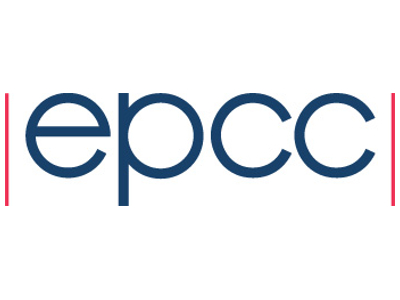

 

<br /><br /><br /><br /><br />

# Make your Python code 10,000 times faster with parallel numpy!

[![CC BY-NC-SA 4.0][cc-by-nc-sa-shield]][cc-by-nc-sa]

<h2>Introduction</h2>

This page details the setup steps you need to take in advance of the
RSECon22 workshop [Make your Python code 10,000 times faster with
parallel
numpy!](https://virtual.oxfordabstracts.com/#/event/3101/submission/103)
on Wednesday 7th September 2022, 09:00 - 12:30 BST.

Participants must bring a laptop with a Mac, Linux, or Windows
operating system (not a tablet, Chromebook, etc.) that they have
administrative privileges on.

In advance of the course, you need to:

  * set up Python, Anaconda, Jupyter notebooks and mpi4py on your laptop;
  * apply for a login account on ARCHER2, the UK National HPC service.

Full instructions are provided below - if there are any issues please
contact [d.henty@epcc.ed.ac.uk](mailto:d.henty@epcc.ed.ac.uk).

<h2>Python setup on your laptop</h2>

<h3>Python environment</h3>

To install Python3, Anaconda and Jupyter Notebooks follow the
[instructions on the Software Carpentries
website](https://swcarpentry.github.io/python-novice-inflammation/setup.html).

If you are a Windows user, note that during installation you should
make sure you check the box **Add Anaconda to my PATH environment
variable**.

Note that this installation can take a long time; for me it stalled
for quite a while at "Setting up the base environment" but did
complete eventually!

<h4>Testing</h4>

To test your numpy installation, download and unzip
[PythonHPCexamples.zip](https://github.com/davidhenty/PythonHPCprep/raw/master/PythonHPCexamples.zip)
and open `examples.ipynb` in a Jupyter notebook. The notebook also
includes a simple test which you can run after installing your MPI
installation below.

<h3>MPI environment</h3>

Once you have the Anaconda distribution, it is a relatively
straightforward matter to install mpi4py and an actual MPI
implementation which is required to do the work underneath.
Installation may take a lot of time so be patient!

A note for users who already have MPI installed (e.g. for C/Fortran):
to prevent name clashes in your PATH it can be useful to use a conda
environment to do the installation - see
[http://conda.pydata.org/docs/using/envs.html](http://conda.pydata.org/docs/using/envs.html). You
can switch to a different environment within a Jupyter notebook using
"Kernel -> Change kernel".

The installation process varies slightly between different
platforms. Don't worry if you have problems with this stage as there
will be time at the workshop to help you, and all parallel exercises
can also be undertaken on ARCHER2 (although not via a noteboook).

Having installed MPI it is **essential** that you completely stop and
restart your notebook to pick up the new environment.

<h4>Mac</h4>

You first need to install MPI at a system level. From a local terminal
type:

````
user@mac> brew install mpi4py
````
If you do not have access to `brew` then you can try this:
````
user@mac> /bin/bash -c "$(curl -fsSL https://raw.githubusercontent.com/Homebrew/install/HEAD/install.sh)"
````
where you will be prompted for your local password as part of the process.

You now need to install the Python bindings for MPI

````
user@mac> conda install -c conda-forge mpi4py
````

<h4>Windows</h4>

Windows users should launch an Anaconda Prompt terminal using `CMD.exe
Prompt` from Anaconda Navigator.

From this terminal type:
````
user@windows> conda install -c conda-forge mpi4py
````

<h4>Linux</h4>

From a local terminal type:
````
user@linux> conda install -c conda-forge mpi4py
````

<h4>Testing</h4>

Run the `mpihello.py` example as instructed in the notebook you
previously downloaded to test Python and numpy.

<h3>ARCHER2 Account</h3>

You will also need an account on the [UK national supercomputer
ARCHER2](https://www.archer2.ac.uk/). As someone who expressed an
interest in this workshop when you registered you will have received
an email detailing how to apply for an account.

This email is appended below if you did not receive the email

Please note:

  * Due to security restrictions we cannot accept ARCHER2 registrations
    from non-institutional accounts (e.g. gmail accounts are not
    accepted). All ".ac.uk" addresses are accepted, and we will also
    consider applications from recognised academic institutions and
    commercial companies.

  * Don't worry if you can't get an ARCHER2 account - all the
    exercises can be done on your laptop and it is only the final
    performance measurements that actually require access to
    ARCHER2. You are welcome to pair up with someone else for this
    session at the workshop.


# Instructions for applying for an account on ARCHER2

Dear all

We are looking forward to welcoming you to the RSECon22 Parallel Numpy course on 7th September 2022.

We would like to invite you to sign up for an account on ARCHER2 for use during the course, and for a short while afterwards, to allow you to complete the practical exercises.    Please do this as soon as possible, and certainly before the start of the course, to allow time to address any issues.

First you need to register for a SAFE account - SAFE is our online administration system.
https://epcced.github.io/safe-docs/safe-for-users/#register

Please ensure you use your academic email address - account applications from 'gmail' type accounts will not be accepted.  If you do not have access to an academic email, please contact training@epcc.ed.ac.uk to discuss access.

If you have an existing SAFE account for ARCHER2 or Tier2 systems, then use your existing SAFE login credentials to log in, rather than creating a new account.

Then set up a password protected ssh key pair
https://docs.archer2.ac.uk/user-guide/connecting/#access-credentials

Then request your ARCHER2 login account.
https://docs.archer2.ac.uk/quick-start/quickstart-users#request-an-archer2-login-account
adding your ssh public key when prompted.

Full documentation is available at https://docs.archer2.ac.uk/quick-start/quickstart-users

The project code is ta083 on ARCHER2

You will receive an email once your account request has been approved and the account has been set up - there may be a delay.

You can then retrieve the initial password
https://docs.archer2.ac.uk/quick-start/quickstart-users#collecting-your-archer2-password

and get logged on
https://docs.archer2.ac.uk/quick-start/quickstart-users#login-to-archer2

Note that when you first log on you will be immediately prompted to change your "ldap password" - please see the 2nd Tip box on the section above.

If you have any issues, please contact the ARCHER2 service desk, support@archer2.ac.uk, and please mention that you are a student on the RSECon22 Parallel Numpy course on 7th September 2022   and are using the Training Project ta083 on the ARCHER2.
---------------------------------------------------

---

This work is licensed under a
[Creative Commons Attribution-NonCommercial-ShareAlike 4.0 International License][cc-by-nc-sa].

[cc-by-nc-sa]: http://creativecommons.org/licenses/by-nc-sa/4.0/
[cc-by-nc-sa-image]: https://licensebuttons.net/l/by-nc-sa/4.0/88x31.png
[cc-by-nc-sa-shield]: https://img.shields.io/badge/License-CC%20BY--NC--SA%204.0-lightgrey.svg

[![CC BY-NC-SA 4.0][cc-by-nc-sa-image]][cc-by-nc-sa]


